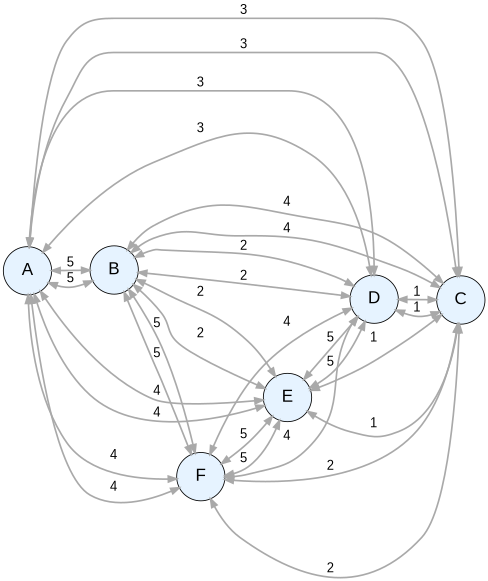

# Traveling Salesman Problem Simulation

An interactive Streamlit app that generates a random complete weighted graph and finds a tour that visits every city exactly once and returns to the start. Three algorithms are available: a fast greedy heuristic and two exact methods.

- App entry point: [traveling-salesman-simulation.py](traveling-salesman-simulation.py)
- System deps: [packages.txt](packages.txt) (`graphviz`)
- Python deps: [requirements.txt](requirements.txt) (`streamlit`, `graphviz`, `Pillow`)

---

## 1. Running the app

```bash
# system binary (once)
sudo apt-get update && sudo apt-get install -y graphviz

# python deps
pip install streamlit graphviz Pillow

# launch
streamlit run traveling-salesman-simulation.py --server.headless true --server.port 8501
```

Then open <http://localhost:8501> (or the forwarded port in Codespaces).

---

## 2. Sidebar controls

| Control | Purpose |
| --- | --- |
| Number of Nodes | Size of the random complete graph (3–10). |
| Maximum Edge Weight | Upper bound for random edge weights. |
| Zoom Level | Scales the rendered Graphviz image. |
| Background / Box / Node / Edge / Path Color | Visual theming. |
| Generate New Graph | Re-randomizes the graph. |
| Starting Node | City the tour starts and ends at. |
| Algorithm | Nearest Neighbor / Brute Force / Held-Karp. |
| Find TSP Path | Runs the chosen algorithm and highlights the tour. |

---

## 3. Algorithms

### 3.1 Nearest Neighbor (greedy heuristic)

From the current city, jump to the closest unvisited city; finally return to start.

- Complexity: $O(n^2)$
- Optimal? **No.** Worst case can be $\Theta(\log n)$ times the optimum on metric instances.
- Use it for: quick baseline, large $n$.

```python
def nearest_neighbor_tsp(self, start):
    unvisited = set(self.nodes.keys())
    path, total = [start], 0
    unvisited.remove(start)
    while unvisited:
        nxt = min(unvisited, key=lambda x: self.edges[path[-1]].get(x, float('inf')))
        total += self.edges[path[-1]][nxt]
        path.append(nxt)
        unvisited.remove(nxt)
    total += self.edges[path[-1]][start]
    path.append(start)
    return path, total
```

### 3.2 Brute Force (exact)

Enumerate every permutation of the non-start cities and keep the cheapest tour.

- Complexity: $O(n!)$
- Optimal? **Yes.**
- Practical limit: $n \le 9$ comfortably; $n = 10$ is borderline.

### 3.3 Held-Karp Dynamic Programming (exact)

State: $dp[(S, i)] = $ minimum cost of a path that starts at the chosen start node, visits exactly the set $S$ of cities, and ends at $i \in S$.

Transition for $j \notin S$:
$$dp[(S \cup \{j\}, j)] = \min\Big(dp[(S \cup \{j\}, j)],\ dp[(S, i)] + d(i, j)\Big)$$

Final answer:
$$\text{OPT} = \min_{i \neq \text{start}} dp[(\{1, \dots, n\}, i)] + d(i, \text{start})$$

- Complexity: $O(n^2 \cdot 2^n)$ time, $O(n \cdot 2^n)$ space.
- Optimal? **Yes.**
- Practical limit: roughly $n \le 20$.

The implementation also stores predecessors so the tour can be reconstructed by walking back through `(mask, end)` states.

### 3.4 Comparison

| Algorithm | Time | Optimal? | Good up to |
| --- | --- | --- | --- |
| Nearest Neighbor | $O(n^2)$ | No | thousands |
| Brute Force | $O(n!)$ | Yes | ~9 |
| Held-Karp DP | $O(n^2 \cdot 2^n)$ | Yes | ~20 |

---

## 4. Code structure

```
Graph
├── add_node / add_edge            # symmetric edges (undirected)
├── get_graphviz(...)              # builds a Digraph for rendering
├── get_mermaid(path)              # alternate textual rendering
├── nearest_neighbor_tsp(start)    # greedy heuristic
├── brute_force_tsp(start)         # exact, O(n!)
└── held_karp_tsp(start)           # exact DP, O(n^2 * 2^n)

create_random_graph(n, max_w)      # random complete graph with labels A, B, C, ...
main()                             # Streamlit UI
```

### Rendering details

- Graphviz uses the `neato` engine (force-directed layout) so the layout reflects the complete-graph structure rather than a strict left-to-right rank.
- When a `path` is supplied, edges that lie consecutively along the tour are drawn in `path_color` with thicker stroke.
- A Mermaid `graph LR` version is also emitted in the second tab for embedding in Markdown.

---

## 5. Suggested experiments

1. Pick `Number of Nodes = 7`, run **Nearest Neighbor** and note the total distance.
2. Without regenerating, switch to **Held-Karp DP** and run again. The optimal distance is $\le$ the heuristic's, often strictly less — this is a concrete demonstration of greedy suboptimality.
3. Increase to 9 nodes and compare **Brute Force** vs **Held-Karp DP** — both produce the same cost, but Held-Karp is noticeably faster.

---

## 6. Possible extensions

- Add **2-opt / 3-opt local search** to improve the nearest-neighbor tour.
- **Animate** the tour construction step by step.
- Show **all three results side-by-side** with a bar chart of total distances.
- Allow **manual edge weights** instead of random.
- Support **asymmetric** TSP by separating directions in `add_edge`.

## 7. TSP Graph



## 8. Mermaid Diagram
``` mmd
graph LR
    A--5-->B
    A--3-->C
    A--3-->D
    A--4-->E
    A--4-->F
    B--5-->A
    B--4-->C
    B--2-->D
    B--2-->E
    B--5-->F
    C--3-->A
    C--4-->B
    C--1-->D
    C--1-->E
    C--2-->F
    D--3-->A
    D--2-->B
    D--1-->C
    D--5-->E
    D--4-->F
    E--4-->A
    E--2-->B
    E--1-->C
    E--5-->D
    E--5-->F
    F--4-->A
    F--5-->B
    F--2-->C
    F--4-->D
    F--5-->E

```
